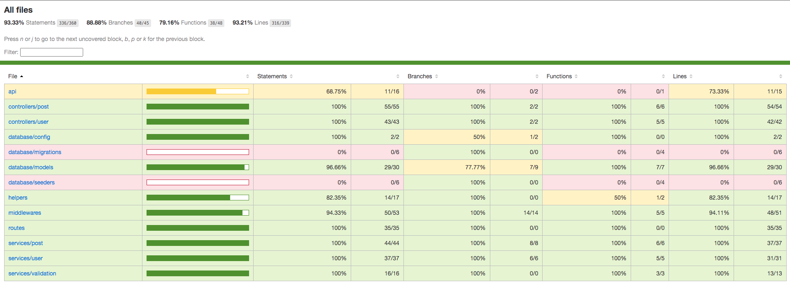

# API de Blogs

## Índice

- [Descrição](#descrição)
- [CI Actions](#ci-actions)
- [Como Usar Online](#como-usar-online)
- [Pré-requisitos](#pré-requisitos-para-rodar-a-aplicação)
- [Como Usar Localmente](#como-usar-no-ambiente-local)
- [Desenvolvimento](#desenvolvimento)
- [Arquitetura](#arquitetura)
- [Outros Scripts da Aplicação](#outros-scripts-configurados-na-aplicação)
- [Cobertura de Testes](#cobertura-de-testes)
- [Pontos de Melhoria](#pontos-de-melhoria)
- [Contato](#contato)

## Descrição

Repositório com o código de uma **API Rest**, em Node.js, Express, usando Sequelize e banco de dados MySQL.

Esta API foi desenvolvida para o desafio técnico do processo seletivo da Trybe. 
O desafio era a construção de uma API de gerenciamento de usuários e posts de Blog. Nela é possível criar, listar e deletar usuários, além de criar, deletar, editar, buscar e listar posts.

As rotas disponíveis são:

- POST/user
- POST/login
- GET/user
- GET/user/:id
- DELETE/user/me
- POST/post
- GET/post
- GET/post/:id
- PUT/post/:id
- GET/post/search?q=:searchTerm
- DELETE/post/:id

Para mais detalhes sobre cada rota, testar a funcionalidade, ver os parâmetros e respostas esperados, acesse o Swagger. (detalhes abaixo)

## CI Actions

Foi implementado `Continuous Integration` nessa aplicação. Na abertura e atualizações de PR's serão executadas duas `actions`: 

- A primeira rodará o ESLint para fazer a análise estática do código.
- A segunda rodará os testes unitários e de integração para analisar a integridade do código.

O arquivo com as `actions` pode ser encontrado [aqui](https://github.com/rslfilho/desafio-trybe/tree/main/.github/workflows).

Fique à vontade para fazer contribuições que achar pertinente nesta aplicação, abrindo um PR. Todas são bem-vindas.

## Como usar online

Apliquei `Continuous Deployment` nessa aplicação:

- Usando a plataforma Heroku. Ela faz parte de uma `pipeline` no Heroku que gera um App de Revisão desta API a cada `Pull Request` iniciada, após aprovação pela `CI`
- Usei o banco de dados parceiro do Heroku, `ClearDB`, para hospedar o banco de dados em produção.

Esse deploy está integrado ao Github, gerando uma nova build sempre que há atualizações na branch `main` deste repositório. 

Para acessar a página Swagger da aplicação rodando e/ou testar a aplicação, ver detalhadamente os parâmetros esperados, as possíveis respostas e sua formatação, basta clicar [aqui](https://rslfilho-trybe.herokuapp.com/swagger/).

Para fazer requisições à aplicação rodando, faça uma requisição ao endpoint `https://rslfilho-trybe.herokuapp.com/`, exemplo para criar um novo usuário:

```bash
curl -X 'POST' \
  'https://rslfilho-trybe.herokuapp.com/user' \
  -H 'accept: application/json' \
  -H 'Content-Type: application/json' \
  -d '{
  "displayName": "<digite o usuário>",
  "email": "<digite o email>",
  "password": "<digite a senha>",
  "image": "<digite a url da imagem>"
}'
```

## Pré-requisitos para rodar a aplicação

- Node.js
- NPM
- MySQL

## Como usar no ambiente local

1 - Para clonar o repositório, vá até o diretório onde deseja clonar, execute o `git clone` e depois entre no diretório criado:

```bash
git clone git@github.com:rslfilho/desafio-trybe.git
cd desafio-trybe
```

2- Já dentro do diretório, instale as depedências (pode usar `npm` ou `yarn`):

```bash
yarn install
```
ou
```bash
npm install
```

3 - Crie um arquivo `.env` na pasta raiz da aplicação com as seguintes variáveis:

```env
NODE_ENV=development
MYSQL_HOST=<localhost_ou_o_endereço_do_seu_MySQL>
MYSQL_USER=<seu_usuário_do_MySQL>
MYSQL_PASSWORD=<sua_senha_do_MySQL>
JWT_SECRET=<segredo_forte>
```

4 - Depois de instaladas as depedências, inicie a aplicação:

```bash
yarn start
```
ou
```bash
npm start
```

5 - A aplicação estárá rodando e acessível em `http://localhost:3000/`. A porta pode modificar se tiver uma variável `PORT` no ambiente que estiver executando;

6 - Para acessar a descrição da API e/ou testar seu funcionamento, ver detalhadamente os parâmetros esperados, as possíveis respostas e sua formatação, basta acessar `http://localhost:3000/swagger/`.

7 - Para conseguir uma previsão, faça uma requisição a um dos endpoints da aplicação `http://localhost:3000/`, exemplo exemplo para criar um novo usuário:

```bash
curl -X 'POST' \
  'http://localhost:3000/user' \
  -H 'accept: application/json' \
  -H 'Content-Type: application/json' \
  -d '{
  "displayName": "<digite o usuário>",
  "email": "<digite o email>",
  "password": "<digite a senha>",
  "image": "<digite a url da imagem>"
}'
```

## Desenvolvimento

Desenvolvi essa aplicação usando TDD. Para cada funcionalidade eu desenvolvi antes os testes unitários e de integração de cada parte isolada, depois construi a funcionalidade e assim por diante.

Primeiro fiz o setup da aplicação, instalando as dependências necessárias e organizando a arquitetura que iria usar. Depois fiz a configuração do ORM Sequelize para pode usar ele para lidar com o Banco de Dados MySQL. Após essas etapas iniciais comecei o desenvolvimento dos primeiros testes e funcionalidades.

A API foi desenvolvida em Node.js com Express, usando Sequelize como ORM e banco de dados MySQL.

Além disso, as dependências da aplicação são:

- `cors@^2.8.5` para liberação de acesso
- `dotenv@^16.0.0` para acesso a variáveis de ambiente localmente
- `joi@^17.6.0` para validação de `schemas` e dados
- `jasonwebtoken@^8.5.1` para autenticação de usuários
- `swagger-ui-express@^4.3.0` para criação da página visual de descrição e teste da API
- `yamljs@^0.3.0` para leitura do arquivo `yaml` de configuração do Swagger

No ambiente de desenvolvimento ainda são usadas as dependências:

- `mocha@^9.2.1`, `chai@^4.3.6`, `chai-http@^4.3.0`, `sinon@^13.0.1` e `sequelize-test-helpers@^1.4.2` para os testes;
- `nyc@^15.1.0` para gerar os relatórios de cobertura de testes
- `nodemon@^2.0.15` para iniciar a aplicação com reinício automático
- `eslint@^8.8.0`, `eslint-config-trybe-backend@^1.0.4`, `eslint-plugin-import@^2.25.4`, `eslint-plugin-mocha@^10.0.3` e `eslint-plugin-sonarjs@ˆ0.11.0` para configuração do ESLint

## Arquitetura

Usei uma arquitetura baseada em MSC (Model, Service, Controller).

Model para conectar, escrever e ler dados do banco de dados; Service para tratar os dados e executar a lógica de negócio da aplicação; e Controller para receber e tratar os dados da requisição e, depois de acessar o Service, retornar a resposta ao usuário.

A API está contida na pasta `/src` dentro da raiz do repositório, nela temos:

- `/api` arquivos de configuração e início da aplicação
- `/controllers` arquivos de Controllers da aplicação
- `/database` arquivos de configuração do Sequelize e os Models da aplicação
- `/helpers` funções ou dados auxiliares
- `/middlewares` arquivos de middlewares como o de Erro, autenticação e validação
- `/routers` configuração de roteadores do Express
- `/services` arquivos de Services da aplicação
- `/tests` arquivos de testes, unitários e de integração

## Outros Scripts configurados na aplicação

* `yarn dev` ou `npm run dev` para rodar a aplicação com Nodemon e reinício automático na atualização de qualquer arquivo;
* `yarn test` ou `npm run test` para rodar todos os testes;
* `yarn test:coverage` ou `npm run test:coverage` para rodar todos os testes e gerar o relatório de cobertura em html, acessível na pasta `/coverage/lcov-report/`;
* `yarn test:unit` ou `npm run test:unit` para rodar apenas os testes unitários;
* `yarn test:unit:coverage` ou `npm run test:unit:coverage` para rodar apenas os testes unitários e gerar o relatório de cobertura na tela do terminal;
* `yarn test:integration` ou `npm run test:integration` para rodar apenas os testes de integração;
* `yarn test:integration:coverage` ou `npm run test:integration:coverage` para rodar apenas os testes de integração e gerar o relatório de cobertura na tela do terminal;
* `yarn lint` ou `npm run lint` para rodar o ESLint;

## Cobertura de testes

Desenvolvi mais de 290 asserções entre testes unitários e de integração para cobertura de testes da aplicação.



A cobertura de testes atingiu mais de 93%.

## Pontos de melhoria

- Adicionar Docker à aplicação, conteinerizando a mesma e tornando mais simples sua entrega;
- Criar uma segunda documentação simples para uso por pessoas não desenvolvedoras

## Contato

Desenvolvido por Roberval Filho

Email: rslfilho@gmail.com

Github: https://github.com/rslfilho

LinkedIn: https://www.linkedin.com/in/rslfilho/
